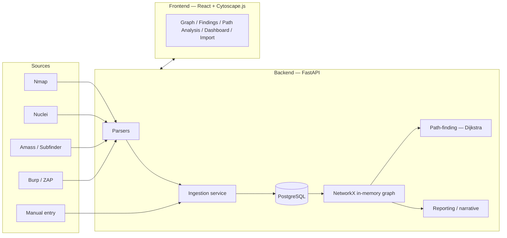

<div align="center">


**Stop reading flat CVSS tables. Start seeing the attack chain.**

[](https://github.com/OWNER/kompromap/actions/workflows/ci.yml)
[](#testing)
[](./LICENSE)


<sub>⚠️ <b>Before pushing:</b> replace <code>OWNER</code> in the CI badge URL with your GitHub username, or it 404s.</sub>

</div>

---

<div align="center">

### A finding is a dot. An attack is a line through them.

```mermaid
flowchart LR
    A["🌐 dev.acme-fin.com<br/><small>entry point</small>"]
    B["⚠️ Subdomain takeover<br/><small>CVSS 8.1</small>"]
    C["🔑 Admin session<br/><small>stolen cookie</small>"]
    D["⚠️ IDOR on /api/v2/users<br/><small>CVSS 7.5</small>"]
    E["🗄️ customer_pii_db<br/><small>284,000 records</small>"]

    A -->|has finding| B
    B -->|yields| C
    C -->|grants access| D
    D -->|yields| E

    style A fill:#0F131B,stroke:#2DD4E8,stroke-width:2px,color:#E7EAF0
    style B fill:#0F131B,stroke:#F5883A,stroke-width:2px,color:#E7EAF0
    style C fill:#0F131B,stroke:#FB7185,stroke-width:2px,color:#E7EAF0
    style D fill:#0F131B,stroke:#F5883A,stroke-width:2px,color:#E7EAF0
    style E fill:#0F131B,stroke:#F2454E,stroke-width:3px,color:#E7EAF0
```

</div>



<div align="center">

<sub>None of those findings is critical alone. Chained, they are a full compromise.<br/>Kompromap assembles that chain automatically — and ranks it by how <em>easy</em> it is.</sub>

</div>

---

<div align="center">

### The problem, in one line

</div>

> Every pentest produces a pile of individually-scored findings — a subdomain takeover here, a stored XSS there, an IDOR somewhere else. **None of them look critical alone. Chained together, they're a full compromise.**

Existing graph tools (BloodHound and friends) map identity and permission graphs *within one system*. That's a different problem from chaining independent technical vulnerabilities across an external web and API surface. Kompromap fills that gap: raw tool output in, attack-chain graph out, with a path-finding engine that answers **"what's the easiest way in?"**

---

---

## Table of contents

- [Features](#features)
- [Architecture](#architecture)
- [Quick start (Docker)](#quick-start-docker)
- [Manual setup](#manual-setup)
- [Deployment](#deployment)
- [API reference](#api-reference)
- [How the scoring & path-finding works](#how-the-scoring--path-finding-works)
- [Multi-engagement design](#multi-engagement-design)
- [Reporting & narrative generation](#reporting--narrative-generation)
- [Testing](#testing)
- [Security](#security)
- [Frontend architecture](#frontend-architecture)
- [Project structure](#project-structure)
- [Roadmap](#roadmap)
- [Contributing](#contributing)
- [License](#license)

## Features

| | |
|---|---|
| 🕸️ **Attack-chain graph** | Cytoscape.js canvas with per-type SVG icons and shapes, distinct line styles for all 7 relationship types, animated layout transitions, hover-to-isolate, and search-as-you-type |
| 📥 **Auto-ingestion** | Drop in raw Nmap, Nuclei, Amass/Subfinder or Burp/ZAP output — it's parsed straight into linked graph nodes, deduplicated by natural key |
| 🎯 **Path-finding** | Dijkstra over a weighted graph (CVSS + exploit availability + auth requirement). Finds the *most realistic* chain, not the shortest — five easy hops can beat one hard one |
| 📊 **Threat gauge** | One number synthesizing how easily an attacker reaches a crown jewel, with the reasoning behind it |
| 📝 **Report narratives** | Plain-English paragraph describing a selected chain, exportable as Markdown or JSON. Works with or without an LLM key |
| 🗂️ **Multi-engagement** | Fully isolated per-client graphs, with point-in-time snapshots and diffing |
| ⌨️ **Keyboard-driven** | Command palette (`Ctrl/Cmd+K`), `/` to search, `f` to filter, `?` for help, `Esc` to close |
| 🔐 **Optional auth** | API-key protection for anything deployed beyond localhost |

## Architecture



Storage is deliberately boring: relational Postgres tables
(`nodes`/`edges` adjacency-list style), loaded into NetworkX in memory for
graph algorithms on request. No graph database — at engagement scale
(hundreds of nodes, not millions), it isn't needed.

## Quick start (Docker)

```bash
git clone https://github.com/<you>/kompromap.git
cd kompromap
docker compose up --build
```

| Service | URL |
|---|---|
| Frontend | http://localhost:5173 |
| Backend API | http://localhost:8000 |
| API docs (Swagger) | http://localhost:8000/docs |
| Postgres | localhost:5432 |

The frontend dev server proxies `/api/*` to the backend, so there's no CORS
configuration needed for local dev.

> [!TIP]
> Want data to explore straight away? The `sample-data/` bundle ships a
> fictional engagement (47 subdomains, 25 services, 44 findings across every
> severity band) plus a script that wires up the exploitation chains — so
> Path Analysis has real answers to give you within a couple of minutes.

## Manual setup

<details>
<summary><strong>Backend</strong></summary>

```bash
cd backend
python -m venv .venv
source .venv/bin/activate      # Windows: .venv\Scripts\activate
pip install -r requirements.txt
cp .env.example .env           # edit if your local Postgres differs
uvicorn app.main:app --reload
```

You'll need a local Postgres instance matching `.env` (default:
`kompromap` / `kompromap` / `kompromap` on `localhost:5432`). Quickest way
without the full compose stack:

```bash
docker run -d --name kompromap-pg \
  -e POSTGRES_USER=kompromap -e POSTGRES_PASSWORD=kompromap -e POSTGRES_DB=kompromap \
  -p 5432:5432 postgres:16-alpine
```

</details>

<details>
<summary><strong>Frontend</strong></summary>

```bash
cd frontend
npm install
npm run dev
```

Visit http://localhost:5173.

</details>

## Deployment

Full guide: **[DEPLOYMENT.md](./DEPLOYMENT.md)**. Short version:

```bash
cp .env.prod.example .env   # edit with real values — see checklist in DEPLOYMENT.md
docker compose -f docker-compose.prod.yml up -d --build
```

This builds production images (backend: no `--reload`, migrations run
automatically on startup; frontend: static build served via nginx, with
`/api` reverse-proxied to the backend so it works same-origin out of the
box), and is meant for a single VM/VPS. `DEPLOYMENT.md` also covers using
the images CI already publishes to GHCR, and split-hosting the frontend
and backend on separate platforms (Vercel/Netlify + Railway/Render/Fly.io).

CI (`.github/workflows/ci.yml`) runs backend tests and frontend
typecheck/build/lint on every push and PR. CD
(`.github/workflows/docker-publish.yml`) builds and pushes both images to
`ghcr.io` on every push to `main`.

## API reference

| Endpoint | Purpose |
|---|---|
| `POST /api/nodes` | Create any node type (body discriminated by `node_type`) |
| `GET /api/nodes` | List nodes — filter by `node_type`, `in_scope`, `is_entry_point`, `is_crown_jewel`, `min_cvss`, `status` |
| `GET/PATCH/DELETE /api/nodes/{id}` | Fetch, partially update, or delete a node |
| `POST /api/edges` | Create an edge between two existing nodes |
| `GET /api/edges` | List edges — filter by `source_node_id`, `target_node_id`, `edge_type` |
| `GET/PATCH/DELETE /api/edges/{id}` | Fetch, update, or delete an edge |
| `POST /api/findings` | Manual finding entry — creates a Finding and its `HAS_FINDING` edge to an Asset/Endpoint in one call |
| `POST /api/ingest/{nmap,nuclei,amass,burp}` | Upload a tool output file and ingest it into the graph |
| `GET /api/graph` | Full graph in Cytoscape.js-ready shape — filter by `node_type`, `in_scope_only`, `min_cvss` |
| `POST /api/pathfind/best` | Easiest path from every (or specified) entry point to any crown jewel |
| `POST /api/pathfind/from/{entry_point_id}` | Easiest path from one entry point to each reachable crown jewel |
| `POST /api/reports/narrative` | Plain-English paragraph describing a chain (ordered `node_ids`), for a pentest report |
| `POST /api/reports/export` | Export a chain as Markdown or structured JSON — narrative + evidence + full node/edge detail |
| `GET/POST /api/engagements` | List / create engagements (workspaces) |
| `GET /api/engagements/active` | The currently active engagement |
| `POST /api/engagements/{id}/activate` | Switch the active engagement |
| `GET /api/engagements/{id}/dashboard` | Node/edge counts, paths to crown jewels, highest-ease chain |
| `GET/POST /api/engagements/{id}/snapshots` | List / capture point-in-time graph snapshots |
| `GET /api/snapshots/{id}/diff` | Diff a snapshot against the current graph, or another snapshot via `?compare_to=` |

Full interactive docs at `/docs` once the backend is running.

## How the scoring & path-finding works

```
ease_score = normalize(cvss_score) * 0.4
           + exploit_public_availability * 0.3
           + (1 - auth_required) * 0.2
           + (1 - complexity) * 0.1
cost = 1 - ease_score
```

Dijkstra minimizes total cost, so the "shortest path" is the *most
realistic* chain, not just the fewest hops — an easy five-hop chain can
beat one hard direct exploit.

Two things worth knowing if you're extending this:

- **`complexity` isn't a stored Finding property anywhere in the data
  model** — only `cvss_score`, `exploit_public`, and `auth_required` are.
  Rather than invent the data, `app/services/scoring.py` uses a
  configurable `default_complexity` (0.5, neutral) applied uniformly. Pass
  `weights.complexity: 0` in a pathfind request if you'd rather it not
  influence anything.
- **Only `YIELDS` edges get a computed ease_score** — the one edge type
  framed as an actual exploitation step ("exploiting this finding gets you
  this"). Every other edge type (`HOSTS`, `EXPOSES`, `HAS_FINDING`,
  `TRUSTS`, `AUTHENTICATES_AS`, `GRANTS_ACCESS_TO`) defaults to zero cost —
  an established relationship, not something you "exploit." Any edge's
  cost can still be overridden manually (the `+ edge` form has a weight
  field), and a manual override always wins over the computed default.

## Multi-engagement design

Every node carries a nullable `engagement_id`. Rather than require every
caller to pass one, there's a single "active engagement" — auto-created
("Default Engagement") the first time anything touches the graph.
`POST /api/engagements/{id}/activate` switches it; node creation,
ingestion, and all list/graph/pathfind endpoints default to whichever
engagement is active unless you pass an explicit `engagement_id`.

This isn't just filtering at read time — ingestion's get-or-create lookups
(dedupe an Asset by name, a Service by asset+port, etc.) are scoped
per-engagement too, so importing the same subdomain into two different
clients' engagements creates two genuinely separate Asset nodes, never a
merge. `tests/test_ingestion.py::test_same_asset_name_in_different_engagements_stays_isolated`
is the test that pins this down.

## Reporting & narrative generation

`POST /api/reports/narrative` and `/api/reports/export` take an ordered
list of `node_ids` (typically a path-finding result, but any connected
chain works) and generate a paragraph describing it.

- **With `ANTHROPIC_API_KEY` set:** calls the real Anthropic API, passing
  the chain's nodes, properties, and Finding evidence as structured
  context.
- **Without a key, or if the call fails for any reason:** falls back to a
  deterministic templated paragraph built directly from the chain data.
  Export always works — a tester shouldn't be blocked by a missing
  credential or a transient API error. `narrative_source` in the response
  (`"llm"` or `"template"`) tells you which happened.
- Export accepts an already-generated (possibly hand-edited) `narrative`
  to skip a redundant LLM call when the tester already reviewed one in the
  UI.

## Testing

```bash
cd backend && pytest -v
cd frontend && npx tsc -b && npm run build && npx eslint src --ext ts,tsx
```

**Backend — 194 tests:** model/mapper checks, parser unit tests against
sanitized fixtures, ingestion (including cross-engagement isolation),
scoring/path-finding validated against the spec's own example chain, full
API coverage for every router, plus security (API-key auth), input
validation (CVSS/port ranges) and Docker-wiring regression suites.

**Frontend — 84 tests:** API client (URL construction, verbs, auth headers,
error handling), design tokens and severity banding, and component tests
for ImportPage, FindingsPage, the command palette, toasts, the threat
gauge, tooltips and the count-up hook (including its reduced-motion
behaviour).

Backend tests run against in-memory SQLite rather than Postgres — the model
layer uses cross-dialect column types (`sqlalchemy.Uuid`,
`JSON().with_variant(...)`) specifically so it's exercisable without a live
database. This produces byte-for-byte identical DDL on Postgres (verified
in `test_models.py`); it's a test-only convenience, not a stack change, and
it means CI needs no database service.

## Security

> [!IMPORTANT]
> **Set `API_KEY` before deploying anywhere reachable off your own machine.**
> Without it every endpoint is open, and this data is a map of a client's
> vulnerabilities.

- **Optional API-key auth.** Unset `API_KEY` = no auth, which is fine on
  localhost and preserves the original single-user workflow. Set it and
  every `/api` route except the health checks requires an `X-API-Key`
  header (constant-time compared), and the OpenAPI docs are hidden.
  **Set this for any deployment reachable off your own machine** — the data
  here is a map of a client's vulnerabilities.
- Uploads are capped (64 MB) and read in chunks, so a large file can't
  exhaust server memory.
- XML parsing uses `defusedxml`, so XXE and billion-laughs payloads in
  scan files are rejected rather than executed.
- All database access goes through SQLAlchemy's expression API — no string
  interpolation into SQL anywhere.
- CVSS scores and ports are range-validated, so bad data can't silently
  corrupt severity banding or path-finding scores.
- Production dependencies carry no known vulnerabilities (`npm audit`
  clean; the two dev-only `vite`/`esbuild` advisories don't apply — the
  production image is a bare nginx stage serving static files, with no
  Vite present).

## Frontend architecture

Persistent sidebar with five sections (Graph / Findings / Path Analysis /
Dashboard / Import) — see `pages/AppShell.tsx`.

- **Design tokens** (`styles/tokens.ts`, `tailwind.config.js`) — dark-first
  palette as CSS custom properties, one deliberate accent (signal cyan),
  a colorblind-considerate severity scale (red→orange→amber→**blue**→gray,
  not red→green), JetBrains Mono for data/IDs, Inter for UI chrome.
- **`GraphCanvas`** — Cytoscape.js, persistent instance (diffed and
  re-laid-out on data changes rather than destroyed/recreated, so layout
  transitions actually animate), per-type SVG icons + shapes, per-edge-type
  line styles, hover highlighting, sequential path-pulse animation for
  path-finding results, search-as-you-type.
- **`FindingsPage`** — sortable/filterable table, severity badges, dense
  mode toggle.
- **`DashboardPage`** — stat cards + a `recharts` findings-by-severity
  chart.
- **`PathAnalysisPage`** — path-finding controls alongside the graph
  showing the highlighted chain; narrative generation and Markdown/JSON
  export live here too.
- **`ImportPage`** — upload UI for all four ingest endpoints, with
  session import history.
- **`CommandPalette`** (Ctrl/Cmd+K), **`ShortcutsHelp`** (`?`) — `/`
  focuses search, `f` focuses the type filter, `Esc` cascades closed
  through whatever's open.
- **`ToastProvider`**, **`Skeleton`**, **`ErrorBanner`**, **`EmptyState`**
  — consistent async-state treatment app-wide, no ad hoc loading/error
  text.

## Project structure

```
backend/
  app/
    api/         # FastAPI routers
    core/        # config, db session
    models/      # SQLAlchemy models
    parsers/     # nmap.py, nuclei.py, amass.py, burp.py
    services/    # ingestion, scoring, pathfinding, reporting, snapshots, engagements
    schemas/     # Pydantic request/response schemas
    main.py      # app entrypoint
  alembic/       # migrations
  tests/
  Dockerfile, Dockerfile.prod
frontend/
  src/
    api/         # fetch wrappers (VITE_API_BASE_URL-aware)
    components/  # shared UI (badges, panels, modals, graph canvas)
    pages/        # AppShell + the 5 sections
    styles/       # design tokens, edge/node style maps
    graph/        # SVG icon generation for Cytoscape
  Dockerfile, Dockerfile.prod, nginx.conf
.github/
  workflows/     # ci.yml, docker-publish.yml
docker-compose.yml         # local dev
docker-compose.prod.yml    # production
DEPLOYMENT.md
kompromap-spec.md
```

## Roadmap

See [`kompromap-spec.md`](./kompromap-spec.md) §7 for the full phased
build plan (Phase 0 scaffold → Phase 1 data layer & parsers → Phase 2 graph
construction & API → Phase 3 visualization → Phase 4 path-finding →
Phase 5 reporting → Phase 6 multi-engagement & polish). All six phases are
complete, followed by a UI modernization pass (design tokens, graph
visual polish, layout/navigation, motion, and empty/loading/error states).

## Contributing

See [CONTRIBUTING.md](./CONTRIBUTING.md).

## License

[MIT](./LICENSE) — a default placeholder; change it if you'd rather use
something else.

---

<div align="center">

<sub>Kompromap turns scan output into the one thing a pentest report is really trying to say:<br/><b>here is the path, and here is how easy it was.</b></sub>

</div>
