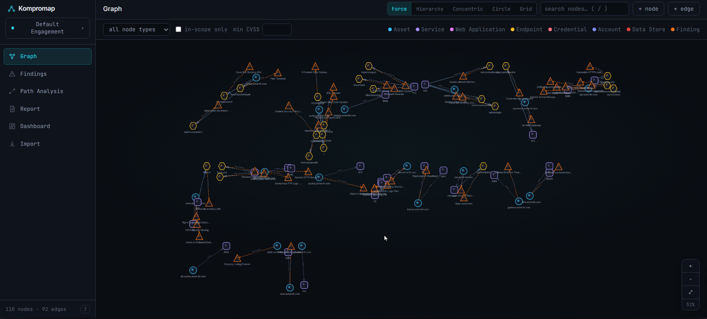
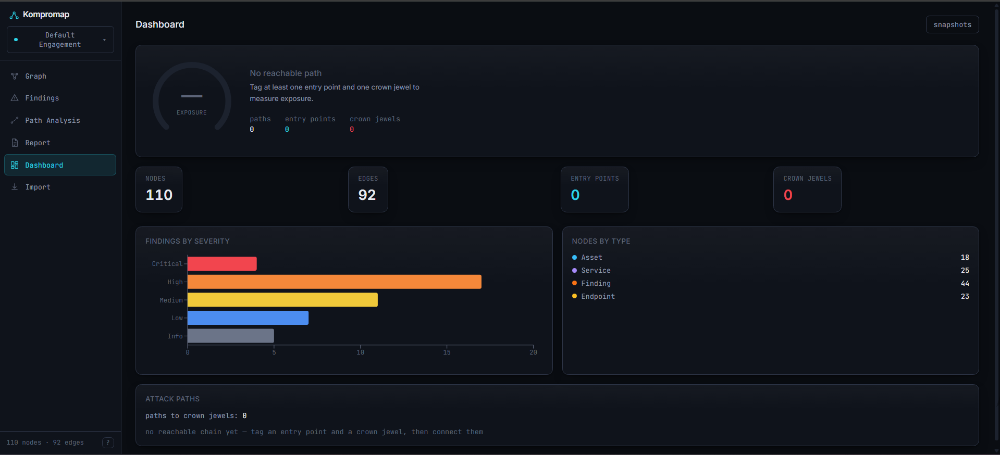
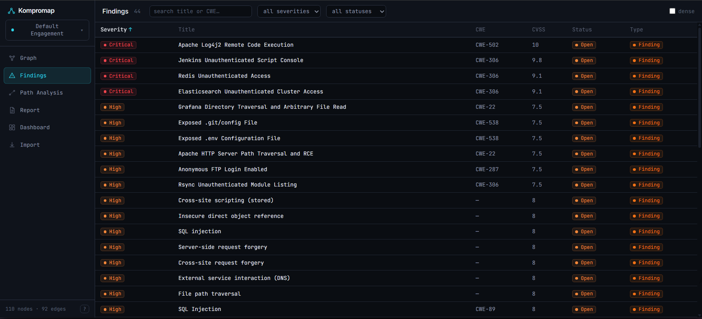
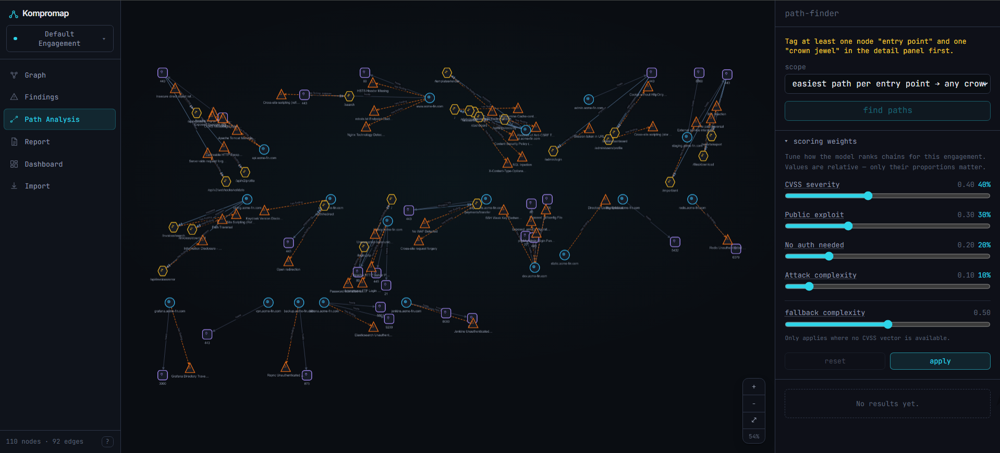
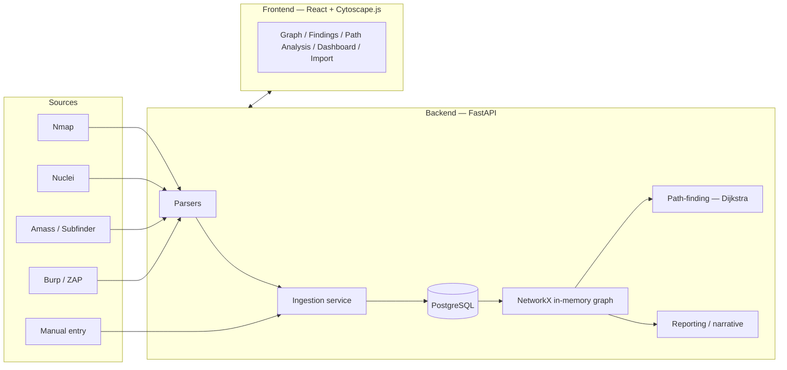

<div align="center">


**Stop reading flat CVSS tables. Start seeing the attack chain.**

[](https://github.com/OWNER/kompromap/actions/workflows/ci.yml)
[](#testing)
[](./LICENSE)


<sub>⚠️ <b>Before pushing:</b> replace <code>OWNER</code> in the CI badge URL with your GitHub username, or it 404s.</sub>

</div>

---

<div align="center">

### A finding is a dot. An attack is a line through them.

```mermaid
flowchart LR
    A["🌐 dev.acme-fin.com<br/><small>entry point</small>"]
    B["⚠️ Subdomain takeover<br/><small>CVSS 8.1</small>"]
    C["🔑 Admin session<br/><small>stolen cookie</small>"]
    D["⚠️ IDOR on /api/v2/users<br/><small>CVSS 7.5</small>"]
    E["🗄️ customer_pii_db<br/><small>284,000 records</small>"]

    A -->|has finding| B
    B -->|yields| C
    C -->|grants access| D
    D -->|yields| E

    style A fill:#0F131B,stroke:#2DD4E8,stroke-width:2px,color:#E7EAF0
    style B fill:#0F131B,stroke:#F5883A,stroke-width:2px,color:#E7EAF0
    style C fill:#0F131B,stroke:#FB7185,stroke-width:2px,color:#E7EAF0
    style D fill:#0F131B,stroke:#F5883A,stroke-width:2px,color:#E7EAF0
    style E fill:#0F131B,stroke:#F2454E,stroke-width:3px,color:#E7EAF0
```

</div>



<div align="center">

<sub>None of those findings is critical alone. Chained, they are a full compromise.<br/>Kompromap assembles that chain automatically — and ranks it by how <em>easy</em> it is.</sub>

</div>

---

<div align="center">

### The problem, in one line

</div>

> Every pentest produces a pile of individually-scored findings — a subdomain takeover here, a stored XSS there, an IDOR somewhere else. **None of them look critical alone. Chained together, they're a full compromise.**

Existing graph tools (BloodHound and friends) map identity and permission graphs *within one system*. That's a different problem from chaining independent technical vulnerabilities across an external web and API surface. Kompromap fills that gap: raw tool output in, attack-chain graph out, with a path-finding engine that answers **"what's the easiest way in?"**

---

---

## Table of contents

- [Features](#features)
- [Screenshots](#screenshots)
- [How it works](#how-it-works)
- [Architecture](#architecture)
- [Quick start (Docker)](#quick-start-docker)
- [Manual setup](#manual-setup)
- [How this compares](#how-this-compares)
- [Deployment](#deployment)
- [API reference](#api-reference)
- [How the scoring & path-finding works](#how-the-scoring--path-finding-works)
- [Multi-engagement design](#multi-engagement-design)
- [Reporting](#reporting)
- [Testing](#testing)
- [Security](#security)
- [Frontend architecture](#frontend-architecture)
- [Project structure](#project-structure)
- [Roadmap](#roadmap)
- [FAQ](#faq)
- [Contributing](#contributing)
- [License](#license)

## Features

| | |
|---|---|
| 🕸️ **Attack-chain graph** | Cytoscape.js canvas with per-type icons and shapes, distinct styling for all 7 relationship types, five switchable layouts (force, hierarchy, concentric, circle, grid), draggable nodes that stay where you put them, right-click actions, hover-to-isolate and search-as-you-type |
| 📥 **Auto-ingestion** | Drop in raw Nmap, Nuclei, Amass/Subfinder or Burp/ZAP output — it's parsed straight into linked graph nodes, deduplicated by natural key |
| 🎯 **Path-finding** | Dijkstra over a weighted graph. Finds the *most realistic* chain, not the shortest — five easy hops can beat one hard one. Per-engagement weight tuning, and every step shows **why** it scored as it did |
| 📊 **Threat gauge** | One number synthesizing how easily an attacker reaches a crown jewel, with the reasoning behind it |
| 🧮 **Real CVSS modelling** | Attack complexity derived from the actual CVSS v3 vector (`AC`/`PR`/`UI`) rather than a placeholder — and the UI distinguishes a *measured* score from an *assumed* one |
| 📄 **Full engagement report** | Executive summary, every finding grouped by severity, every chain with its scoring rationale, chain-aware remediation priorities, and the report's own caveats — exported as printable HTML, Markdown or JSON |
| 📝 **Chain narratives** | Plain-English paragraph describing a selected chain. Works with or without an LLM key |
| 🗂️ **Multi-engagement** | Fully isolated per-client graphs, with point-in-time snapshots and diffing |
| ⌨️ **Keyboard-driven** | Command palette (`Ctrl/Cmd+K`), `/` to search, `f` to filter, `?` for help, `Esc` to close |
| 🔐 **Optional auth** | API-key protection for anything deployed beyond localhost |

## Screenshots

> [!NOTE]
> Placeholder — drop real captures into `docs/screenshots/` and the images
> below will render. Suggested set: the graph with a highlighted chain, the
> dashboard threat gauge, the findings table, and an expanded path with its
> score breakdown.

<table>
<tr>
<td width="50%"><br/><sub><b>Graph</b> — a highlighted chain pulsing from entry point to crown jewel</sub></td>
<td width="50%"><br/><sub><b>Dashboard</b> — threat gauge, severity breakdown, highest-ease chain</sub></td>
</tr>
<tr>
<td><br/><sub><b>Findings</b> — sortable, filterable, severity-banded</sub></td>
<td><br/><sub><b>Path Analysis</b> — why each step costs what it does</sub></td>
</tr>
</table>

## How it works

Four steps, start to finish.

<table>
<tr><td width="60" align="center"><h3>1</h3></td><td>

**Import what your tools already produced**

Drop raw output into the Import tab — Nmap XML, Nuclei JSON, Amass/Subfinder lists, Burp or ZAP exports. Kompromap parses each into typed graph nodes and links them: services get attached to the assets that host them, endpoints to the apps that expose them, findings to whatever they were found on. Re-importing is safe; everything dedupes on a natural key.

</td></tr>
<tr><td align="center"><h3>2</h3></td><td>

**Tag the two ends of the story**

Mark your entry points (what an unauthenticated attacker can reach) and your crown jewels (what actually matters if it's lost). Right-click any node on the graph, or use the detail panel. Nothing else in the tool means anything until these exist — they're the "from" and "to" of every question it answers.

</td></tr>
<tr><td align="center"><h3>3</h3></td><td>

**Connect the exploitation steps**

Scanners tell you a finding exists; they can't tell you that exploiting *this* yields *that* credential. That judgement is yours. Add `YIELDS`, `AUTHENTICATES_AS` and `GRANTS_ACCESS_TO` edges to express it — this is the part that turns a pile of findings into a chain.

</td></tr>
<tr><td align="center"><h3>4</h3></td><td>

**Ask for the easiest path**

Path Analysis runs Dijkstra across the weighted graph and ranks every route from entry point to crown jewel by how *easy* it is, not how short. Pick one and it pulses along the graph; generate a plain-English narrative; export to Markdown or JSON for the report.

</td></tr>
</table>

## Architecture



Storage is deliberately boring: relational Postgres tables
(`nodes`/`edges` adjacency-list style), loaded into NetworkX in memory for
graph algorithms on request. No graph database — at engagement scale
(hundreds of nodes, not millions), it isn't needed.


### The data model

Eight node types and seven edge types. Everything in the graph is one of these.

<table>
<tr><th align="left" width="50%">Nodes — the things</th><th align="left">Edges — the relationships</th></tr>
<tr valign="top"><td>

| Type | What it is |
|---|---|
| **Asset** | A domain, subdomain, IP or host |
| **Service** | A port + protocol on an asset |
| **WebApplication** | An app served by a service |
| **Endpoint** | A specific path on an app |
| **Credential** | A password, token, key or session |
| **Account** | An identity a credential authenticates as |
| **DataStore** | A database, bucket or file share |
| **Finding** | A vulnerability, with CVSS and evidence |

</td><td>

| Type | Meaning |
|---|---|
| `HOSTS` | Asset runs this service |
| `EXPOSES` | Service serves this app/endpoint |
| `HAS_FINDING` | This vulnerability was found here |
| `YIELDS` | **Exploiting this gets you that** |
| `AUTHENTICATES_AS` | Credential logs in as account |
| `GRANTS_ACCESS_TO` | Account can reach this |
| `TRUSTS` | Implicit trust relationship |

</td></tr>
</table>

**`YIELDS` is the one that carries weight.** Every other edge describes something you *observed*; `YIELDS` describes an exploitation step an attacker would have to actually perform. That's why it's the only edge type the scoring model assigns a cost to — structural edges are free, because walking from an asset to the service it hosts costs an attacker nothing.

Any edge's cost can still be overridden by hand when your judgement beats the model.


### A worked example

Running the bundled sample dataset through Path Analysis produces this — four routes from an entry point to a crown jewel, ranked by ease:

```
cost   chain
─────  ──────────────────────────────────────────────────────────────────────
0.250  api.acme-fin.com → Log4Shell → db password → app_readwrite → customer_pii_db
0.258  jenkins.acme-fin.com → unauth script console → jenkins-ci → api key → card_vault
0.630  admin.acme-fin.com → :443 → /admin/users/profile → stored XSS → session
       → svc-admin → customer_pii_db
0.650  staging.acme-fin.com → :443 → /reports/export → SQL injection → customer_pii_db
```

Look at the ordering. **The 7-hop XSS chain ranks above the 4-hop SQL injection chain** — because the SQLi step was weighted as harder by hand, and Kompromap ranks by *attacker effort*, not hop count. That inversion is the entire reason the tool exists; a flat findings table would have sorted these by CVSS and told you the opposite story.

Two entry points also come back as **unreachable**: they have findings, but no onward exploitation edge connects them to anything that matters. That's not a gap in the output — it's the tool telling you where you haven't finished testing yet.

Expanding a chain shows why each step costs what it does:

```
why this step costs 0.618                              [measured]
████████████░░░░░░░░░░░░░░░░
● CVSS              +0.360      ● no auth        +0.000
● public exploit    +0.000      ● low complexity +0.021
                                        ease score  0.382
```

The `measured` badge matters: complexity here was read from the finding's real CVSS vector (`AC:H/PR:H/UI:R`), not assumed. Findings without a vector show `assumed` instead — the tool never presents a guess with the same confidence as a measurement.

## Quick start (Docker)

```bash
git clone https://github.com/<you>/kompromap.git
cd kompromap
docker compose up --build
```

| Service | URL |
|---|---|
| Frontend | http://localhost:5173 |
| Backend API | http://localhost:8000 |
| API docs (Swagger) | http://localhost:8000/docs |
| Postgres | localhost:5432 |

The frontend dev server proxies `/api/*` to the backend, so there's no CORS
configuration needed for local dev.

> [!TIP]
> Want data to explore straight away? The `sample-data/` bundle ships a
> fictional engagement (47 subdomains, 25 services, 44 findings across every
> severity band) plus a script that wires up the exploitation chains — so
> Path Analysis has real answers to give you within a couple of minutes.

## Manual setup

<details>
<summary><strong>Backend</strong></summary>

```bash
cd backend
python -m venv .venv
source .venv/bin/activate      # Windows: .venv\Scripts\activate
pip install -r requirements.txt
cp .env.example .env           # edit if your local Postgres differs
uvicorn app.main:app --reload
```

You'll need a local Postgres instance matching `.env` (default:
`kompromap` / `kompromap` / `kompromap` on `localhost:5432`). Quickest way
without the full compose stack:

```bash
docker run -d --name kompromap-pg \
  -e POSTGRES_USER=kompromap -e POSTGRES_PASSWORD=kompromap -e POSTGRES_DB=kompromap \
  -p 5432:5432 postgres:16-alpine
```

</details>

<details>
<summary><strong>Frontend</strong></summary>

```bash
cd frontend
npm install
npm run dev
```

Visit http://localhost:5173.

</details>


## How this compares

| | Kompromap | BloodHound | DefectDojo / Faraday | A spreadsheet |
|---|---|---|---|---|
| **Domain** | External web/API surface | Active Directory | Any (vuln management) | Any |
| **Core question** | *What's the easiest path in?* | *Who can reach Domain Admin?* | *What's still open?* | *What did we find?* |
| **Chains findings** | ✅ | ✅ (within AD) | ❌ | ❌ |
| **Ranks by attacker effort** | ✅ | Partially | ❌ | ❌ |
| **Ingests scanner output** | ✅ | Via collectors | ✅ | Manually |
| **Scope** | One engagement | One AD forest | Whole programme | Whatever you paste |

Kompromap isn't a replacement for a vulnerability manager — it doesn't track remediation SLAs, ownership or history across programmes. It answers one question that those tools don't: given everything you found on *this* engagement, what's the shortest realistic route from outside to the thing that matters.

BloodHound is the closest relative in spirit, but it maps identity and permission relationships inside one system. Chaining a subdomain takeover into a stored XSS into an IDOR is a different graph entirely.

## Deployment

Full guide: **[DEPLOYMENT.md](./DEPLOYMENT.md)**. Pick the row that matches what you're doing.

| Where | Best for | Cost | Trade-off |
|---|---|---|---|
| **Your own machine** | Real engagement work | Free | Not reachable by anyone else |
| **A VPS** (Hetzner, DigitalOcean…) | Actually using it with a team | ~€4/mo | You maintain a server |
| **Split: Pages + Render/Railway** | Showing the project off | Free tier | Cold starts; API key is public |

**Single VM — the recommended path:**

```bash
cp .env.prod.example .env   # set POSTGRES_PASSWORD, API_KEY, CORS_ORIGINS
docker compose -f docker-compose.prod.yml up -d --build
```

Builds production images (backend without `--reload`, migrations run
automatically on startup; frontend as a static build served by nginx with
`/api` reverse-proxied so it works same-origin out of the box). Put Caddy
or Traefik in front for TLS — `DEPLOYMENT.md` has a three-line Caddyfile.

> [!NOTE]
> **Can this be hosted entirely on GitHub?** Not quite. GitHub Pages serves
> static files only — the React frontend can live there, but FastAPI needs a
> running Python process and Postgres needs a running database. The realistic
> split is Pages for the frontend plus a free-tier PaaS (Render, Railway,
> Fly.io) for the backend, all deploying from `backend/Dockerfile.prod`
> without Docker Desktop on your machine. Be aware that on a public
> deployment `VITE_API_KEY` is baked into the JS bundle and readable from
> DevTools, so it gates casual access rather than being a real secret.

**Automation already in place:**

- `ci.yml` — backend tests + frontend typecheck/test/build/lint on every push and PR
- `docker-publish.yml` — builds and pushes both images to `ghcr.io` on every push to `main`

## API reference

| Endpoint | Purpose |
|---|---|
| `POST /api/nodes` | Create any node type (body discriminated by `node_type`) |
| `GET /api/nodes` | List nodes — filter by `node_type`, `in_scope`, `is_entry_point`, `is_crown_jewel`, `min_cvss`, `status` |
| `GET/PATCH/DELETE /api/nodes/{id}` | Fetch, partially update, or delete a node |
| `POST /api/edges` | Create an edge between two existing nodes |
| `GET /api/edges` | List edges — filter by `source_node_id`, `target_node_id`, `edge_type` |
| `GET/PATCH/DELETE /api/edges/{id}` | Fetch, update, or delete an edge |
| `POST /api/findings` | Manual finding entry — creates a Finding and its `HAS_FINDING` edge to an Asset/Endpoint in one call |
| `POST /api/ingest/{nmap,nuclei,amass,burp}` | Upload a tool output file and ingest it into the graph |
| `GET /api/graph` | Full graph in Cytoscape.js-ready shape — filter by `node_type`, `in_scope_only`, `min_cvss` |
| `POST /api/pathfind/best` | Easiest path from every (or specified) entry point to any crown jewel |
| `POST /api/pathfind/from/{entry_point_id}` | Easiest path from one entry point to each reachable crown jewel |
| `POST /api/reports/narrative` | Plain-English paragraph describing a chain (ordered `node_ids`), for a pentest report |
| `POST /api/reports/export` | Export a single chain as Markdown or structured JSON |
| `POST /api/reports/engagement` | **Full engagement report** — all findings, chains, scope, prioritised remediation and caveats, as `json`, `markdown` or self-contained printable `html` |
| `GET/POST /api/engagements` | List / create engagements (workspaces) |
| `GET /api/engagements/active` | The currently active engagement |
| `POST /api/engagements/{id}/activate` | Switch the active engagement |
| `GET /api/engagements/{id}/dashboard` | Node/edge counts, paths to crown jewels, highest-ease chain |
| `GET/POST /api/engagements/{id}/snapshots` | List / capture point-in-time graph snapshots |
| `GET /api/snapshots/{id}/diff` | Diff a snapshot against the current graph, or another snapshot via `?compare_to=` |

Full interactive docs at `/docs` once the backend is running.

## How the scoring & path-finding works

```
ease_score = normalize(cvss_score) * 0.4
           + exploit_public_availability * 0.3
           + (1 - auth_required) * 0.2
           + (1 - complexity) * 0.1
cost = 1 - ease_score
```

Dijkstra minimizes total cost, so the "shortest path" is the *most
realistic* chain, not just the fewest hops — an easy five-hop chain can
beat one hard direct exploit.

Two things worth knowing if you're extending this:

- **`complexity` comes from the CVSS vector when there is one.** Attack
  Complexity is a first-class CVSS v3 field (`AC:L`/`AC:H`), and Nuclei
  templates carrying `cvss-metrics` give it to us for free — so a
  one-click unauthenticated RCE and a race condition needing a MITM
  position no longer score identically. `Privileges Required` and
  `User Interaction` feed in too, weighted lower since they're
  preconditions rather than difficulty proper. Findings with no vector
  fall back to a configurable `default_complexity` (0.5), and the API
  reports which happened via `complexity_measured` so the UI never
  presents an assumption with the same confidence as a measurement.
- **Only `YIELDS` edges get a computed ease_score** — the one edge type
  framed as an actual exploitation step ("exploiting this finding gets you
  this"). Every other edge type (`HOSTS`, `EXPOSES`, `HAS_FINDING`,
  `TRUSTS`, `AUTHENTICATES_AS`, `GRANTS_ACCESS_TO`) defaults to zero cost —
  an established relationship, not something you "exploit." Any edge's
  cost can still be overridden manually (the `+ edge` form has a weight
  field), and a manual override always wins over the computed default.

## Multi-engagement design

Every node carries a nullable `engagement_id`. Rather than require every
caller to pass one, there's a single "active engagement" — auto-created
("Default Engagement") the first time anything touches the graph.
`POST /api/engagements/{id}/activate` switches it; node creation,
ingestion, and all list/graph/pathfind endpoints default to whichever
engagement is active unless you pass an explicit `engagement_id`.

This isn't just filtering at read time — ingestion's get-or-create lookups
(dedupe an Asset by name, a Service by asset+port, etc.) are scoped
per-engagement too, so importing the same subdomain into two different
clients' engagements creates two genuinely separate Asset nodes, never a
merge. `tests/test_ingestion.py::test_same_asset_name_in_different_engagements_stays_isolated`
is the test that pins this down.

## Reporting

### Full engagement report

`POST /api/reports/engagement` (or the **Report** tab) assembles the whole
engagement into a deliverable:

- **Executive summary** — severity distribution, chain count, and how many
  findings actually sit on a path to something that matters
- **Attack chains** — every route from entry point to crown jewel, with
  per-step costs and exploitation steps marked
- **Findings** — grouped by severity, with CVSS vector, affected assets,
  evidence, and flags for public exploits and chain membership
- **Remediation priority** — **ranked by chain impact, not raw severity.**
  A medium finding on the cheapest path to a crown jewel outranks an
  unreachable critical, because breaking any single step breaks the whole
  chain. Ranking by CVSS alone would reproduce exactly the flat table this
  tool exists to replace
- **Scope inventory** — everything mapped, by type
- **Caveats** — what the report *doesn't* know: findings with assumed
  rather than measured complexity, missing evidence, high-severity findings
  not on any chain, and whether "no chain found" means "no path exists" or
  just "exploitation edges haven't been added yet"

Three formats: `html` (self-contained, print stylesheet included — opens
anywhere and prints straight to PDF without a PDF toolchain in the image),
`markdown` (paste into an existing template), and `json` (structured, for
a custom template).

Nothing is invented. Where evidence, CVSS or a vector is missing, the
report says so — a deliverable that quietly implies more rigour than was
performed is worse than one with visible gaps.

### Chain narratives

`POST /api/reports/narrative` and `/api/reports/export` take an ordered
list of `node_ids` (typically a path-finding result, but any connected
chain works) and generate a paragraph describing it.

- **With `ANTHROPIC_API_KEY` set:** calls the real Anthropic API, passing
  the chain's nodes, properties, and Finding evidence as structured
  context.
- **Without a key, or if the call fails for any reason:** falls back to a
  deterministic templated paragraph built directly from the chain data.
  Export always works — a tester shouldn't be blocked by a missing
  credential or a transient API error. `narrative_source` in the response
  (`"llm"` or `"template"`) tells you which happened.
- Export accepts an already-generated (possibly hand-edited) `narrative`
  to skip a redundant LLM call when the tester already reviewed one in the
  UI.

## Testing

```bash
cd backend && pytest -v
cd frontend && npx tsc -b && npm run build && npx eslint src --ext ts,tsx
```

**Backend — 254 tests:** model/mapper checks, parser unit tests against
sanitized fixtures, ingestion (including cross-engagement isolation),
scoring/path-finding validated against the spec's own example chain, full
API coverage for every router, plus security (API-key auth), input
validation (CVSS/port ranges) and Docker-wiring regression suites.

**Frontend — 150 tests:** API client (URL construction, verbs, auth headers,
error handling), design tokens and severity banding, and component tests
for ImportPage, FindingsPage, the command palette, toasts, the threat
gauge, tooltips and the count-up hook (including its reduced-motion
behaviour).

Backend tests run against in-memory SQLite rather than Postgres — the model
layer uses cross-dialect column types (`sqlalchemy.Uuid`,
`JSON().with_variant(...)`) specifically so it's exercisable without a live
database. This produces byte-for-byte identical DDL on Postgres (verified
in `test_models.py`); it's a test-only convenience, not a stack change, and
it means CI needs no database service.

## Security

> [!IMPORTANT]
> **Set `API_KEY` before deploying anywhere reachable off your own machine.**
> Without it every endpoint is open, and this data is a map of a client's
> vulnerabilities.

- **Optional API-key auth.** Unset `API_KEY` = no auth, which is fine on
  localhost and preserves the original single-user workflow. Set it and
  every `/api` route except the health checks requires an `X-API-Key`
  header (constant-time compared), and the OpenAPI docs are hidden.
  **Set this for any deployment reachable off your own machine** — the data
  here is a map of a client's vulnerabilities.
- Uploads are capped (64 MB) and read in chunks, so a large file can't
  exhaust server memory.
- XML parsing uses `defusedxml`, so XXE and billion-laughs payloads in
  scan files are rejected rather than executed.
- All database access goes through SQLAlchemy's expression API — no string
  interpolation into SQL anywhere.
- CVSS scores and ports are range-validated, so bad data can't silently
  corrupt severity banding or path-finding scores.
- Production dependencies carry no known vulnerabilities (`npm audit`
  clean; the two dev-only `vite`/`esbuild` advisories don't apply — the
  production image is a bare nginx stage serving static files, with no
  Vite present).

## Frontend architecture

Persistent sidebar with five sections (Graph / Findings / Path Analysis /
Dashboard / Import) — see `pages/AppShell.tsx`.

- **Design tokens** (`styles/tokens.ts`, `tailwind.config.js`) — dark-first
  palette as CSS custom properties, one deliberate accent (signal cyan),
  a colorblind-considerate severity scale (red→orange→amber→**blue**→gray,
  not red→green), JetBrains Mono for data/IDs, Inter for UI chrome.
- **`GraphCanvas`** — Cytoscape.js, persistent instance (diffed and
  re-laid-out on data changes rather than destroyed/recreated, so layout
  transitions actually animate), per-type SVG icons + shapes, per-edge-type
  line styles, hover highlighting, sequential path-pulse animation for
  path-finding results, search-as-you-type.
- **`FindingsPage`** — sortable/filterable table, severity badges, dense
  mode toggle.
- **`DashboardPage`** — stat cards + a `recharts` findings-by-severity
  chart.
- **`PathAnalysisPage`** — path-finding controls alongside the graph
  showing the highlighted chain; narrative generation and Markdown/JSON
  export live here too.
- **`ImportPage`** — upload UI for all four ingest endpoints, with
  session import history.
- **`CommandPalette`** (Ctrl/Cmd+K), **`ShortcutsHelp`** (`?`) — `/`
  focuses search, `f` focuses the type filter, `Esc` cascades closed
  through whatever's open.
- **`ToastProvider`**, **`Skeleton`**, **`ErrorBanner`**, **`EmptyState`**
  — consistent async-state treatment app-wide, no ad hoc loading/error
  text.

## Project structure

```
backend/
  app/
    api/         # FastAPI routers
    core/        # config, db session
    models/      # SQLAlchemy models
    parsers/     # nmap.py, nuclei.py, amass.py, burp.py
    services/    # ingestion, scoring, pathfinding, reporting, snapshots, engagements
    schemas/     # Pydantic request/response schemas
    main.py      # app entrypoint
  alembic/       # migrations
  tests/
  Dockerfile, Dockerfile.prod
frontend/
  src/
    api/         # fetch wrappers (VITE_API_BASE_URL-aware)
    components/  # shared UI (badges, panels, modals, graph canvas)
    pages/        # AppShell + the 5 sections
    styles/       # design tokens, edge/node style maps
    graph/        # SVG icon generation for Cytoscape
  Dockerfile, Dockerfile.prod, nginx.conf
.github/
  workflows/     # ci.yml, docker-publish.yml
docker-compose.yml         # local dev
docker-compose.prod.yml    # production
DEPLOYMENT.md
kompromap-spec.md
```

## Roadmap

See [`kompromap-spec.md`](./kompromap-spec.md) §7 for the full phased
build plan (Phase 0 scaffold → Phase 1 data layer & parsers → Phase 2 graph
construction & API → Phase 3 visualization → Phase 4 path-finding →
Phase 5 reporting → Phase 6 multi-engagement & polish). All six phases are
complete, followed by a UI modernization pass (design tokens, graph
visual polish, layout/navigation, motion, and empty/loading/error states).

## FAQ

<details>
<summary><b>Do I have to use all four scanners?</b></summary>

No. Each import is independent — bring only Nmap output, or only a Burp export, or nothing at all and build the graph by hand. The parsers auto-create any referenced asset that doesn't exist yet, so importing findings before their hosts works fine.

</details>

<details>
<summary><b>Why doesn't it find chains automatically after import?</b></summary>

Because it can't, honestly. A scanner tells you a stored XSS exists on `/admin/profile`. Nothing in that output says exploiting it yields an admin session cookie that authenticates as `svc-admin` who can read `customer_pii_db`. That's a chain of judgements a tester makes.

Ingestion builds the *structural* graph — what hosts what, where findings live. You add the `YIELDS` edges that express exploitation. The sample dataset ships a script showing exactly what that looks like.

</details>

<details>
<summary><b>What if a finding has no CVSS vector?</b></summary>

It falls back to a configurable default complexity (0.5), and the UI labels that score **assumed** rather than **measured**. Nuclei templates with `cvss-metrics` give real vectors for free; Burp and ZAP exports generally don't, so mixed confidence is normal and worth seeing.

</details>

<details>
<summary><b>Do I need an Anthropic API key?</b></summary>

No. Without one, narrative generation falls back to a deterministic template built from the chain data — export always works. With a key, you get a more fluent paragraph. The response tells you which you got via `narrative_source`.

</details>

<details>
<summary><b>Why Postgres and not a graph database?</b></summary>

Engagement graphs are hundreds of nodes, not millions. Relational tables load into NetworkX in memory in milliseconds at that scale, and Postgres brings migrations, transactions and operational familiarity that Neo4j would trade away for performance nobody here needs. Verified against a synthetic 400-node graph — the layout render is the bottleneck, not the query.

</details>

<details>
<summary><b>Is my engagement data safe on a deployed instance?</b></summary>

Only if you set `API_KEY`. Without it every endpoint is open to anyone who finds the URL, and this data is a map of a client's vulnerabilities. On a split-hosted setup the frontend's copy of that key is readable from the JS bundle — so treat it as a gate against drive-by access, not a real secret. For anything sensitive, run it somewhere private.

</details>

<details>
<summary><b>Can I run multiple clients in one instance?</b></summary>

Yes — engagements are fully isolated workspaces. Ingestion dedupe is scoped per-engagement too, so the same subdomain imported into two clients' engagements creates two separate nodes rather than merging them. There's a test pinning exactly that behaviour.

</details>

## Contributing

See [CONTRIBUTING.md](./CONTRIBUTING.md).

## License

[MIT](./LICENSE) — a default placeholder; change it if you'd rather use
something else.

---

<div align="center">

<sub>Kompromap turns scan output into the one thing a pentest report is really trying to say:<br/><b>here is the path, and here is how easy it was.</b></sub>

</div>
